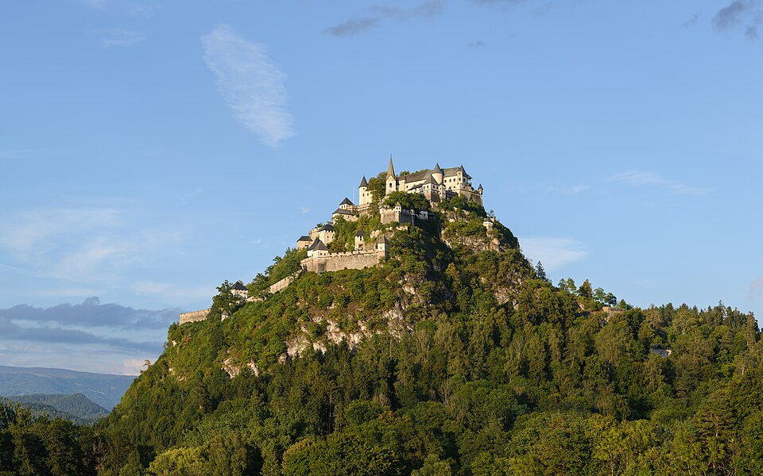

#
{: .wrap}

Lorem ipsum dolor sit amet, consectetur adipiscing elit, sed do eiusmod tempor incididunt ut labore et dolore magna aliqua. Ut enim ad minim veniam, quis nostrud exercitation ullamco laboris nisi ut aliquip ex ea commodo consequat. Duis aute irure dolor in reprehenderit in voluptate velit esse cillum dolore eu fugiat nulla pariatur. Excepteur sint occaecat cupidatat non proident, sunt in culpa qui officia deserunt mollit anim id est laborum.

#
{: .wrap}

sunflower Lorem ipsum dolor sit amet, consectetur adipiscing elit, sed do eiusmod tempor incididunt ut labore et dolore magna aliqua. Ut enim ad minim veniam, quis nostrud exercitation ullamco laboris nisi ut aliquip ex ea commodo consequat. Duis aute irure dolor in reprehenderit in voluptate velit esse cillum dolore eu fugiat nulla pariatur. Excepteur sint occaecat cupidatat non proident, sunt in culpa qui officia deserunt mollit anim id est laborum.

<iframe src="https://www.juncture-digital.io/image/?src=wc:Sunflower_sky_backdrop.jpg&caption=Sunflower" style="aspect-ratio:1;"></iframe>

#
{: .columns}

Lorem ipsum dolor sit amet, consectetur adipiscing elit, sed do eiusmod tempor incididunt ut labore et dolore magna aliqua. Ut enim ad minim veniam, quis nostrud exercitation ullamco laboris nisi ut aliquip ex ea commodo consequat. Duis aute irure dolor in reprehenderit in voluptate velit esse cillum dolore eu fugiat nulla pariatur. Excepteur sint occaecat cupidatat non proident, sunt in culpa qui officia deserunt mollit anim id est laborum.

Lorem ipsum dolor sit amet, consectetur adipiscing elit, sed do eiusmod tempor incididunt ut labore et dolore magna aliqua. Ut enim ad minim veniam, quis nostrud exercitation ullamco laboris nisi ut aliquip ex ea commodo consequat. Duis aute irure dolor in reprehenderit in voluptate velit esse cillum dolore eu fugiat nulla pariatur. Excepteur sint occaecat cupidatat non proident, sunt in culpa qui officia deserunt mollit anim id est laborum.

# Card Grid Example

## Popular Flowers
{: .cards}

### Rose (Rosa spp.)

Classic symbol of love; thousands of cultivars give you every hue from velvety reds to delicate pastels, plus modern disease‑resistant shrub types.

### Peony (Paeonia spp.)

Huge, ruffled blooms in late spring; intoxicating fragrance and a palette that ranges from blush pink to rich burgundy.

### Orchid (family Orchidaceae)

Exotic architecture and intricate patterns; genera like Phalaenopsis are now easy to grow indoors and bloom for months.

### Tulip (Tulipa spp.)

Icon of spring gardens; single, double, fringed, or parrot forms in nearly every color—even dramatic two‑tone “Rembrandt” streaks.

### Dahlia (Dahlia spp.)

Summer‑to‑frost fireworks with dinner‑plate giants, pom‑poms, cactus types, and new “café au lait” pastel cultivars popular in bouquets.

### Hydrangea (Hydrangea macrophylla & relatives) 

[**Hydrangea** (*Hydrangea macrophylla* & relatives) ](#)

Show‑stopping mophead or lace‑cap clusters; soil pH trick lets you shift some varieties from pink to blue.